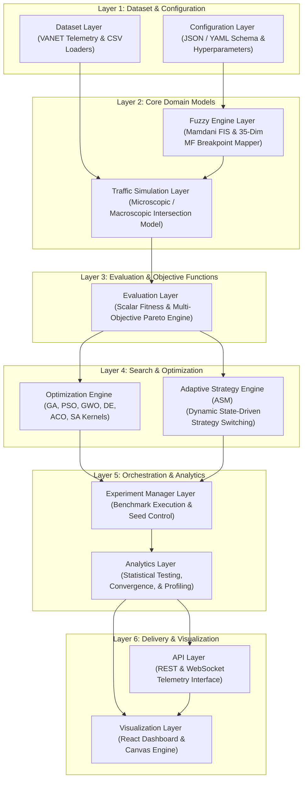
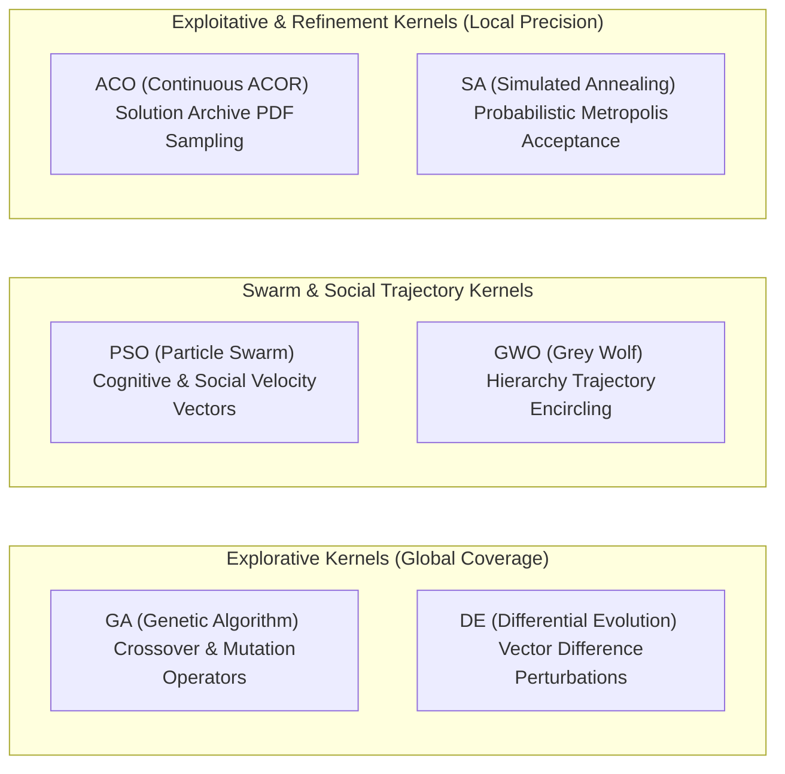
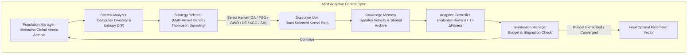
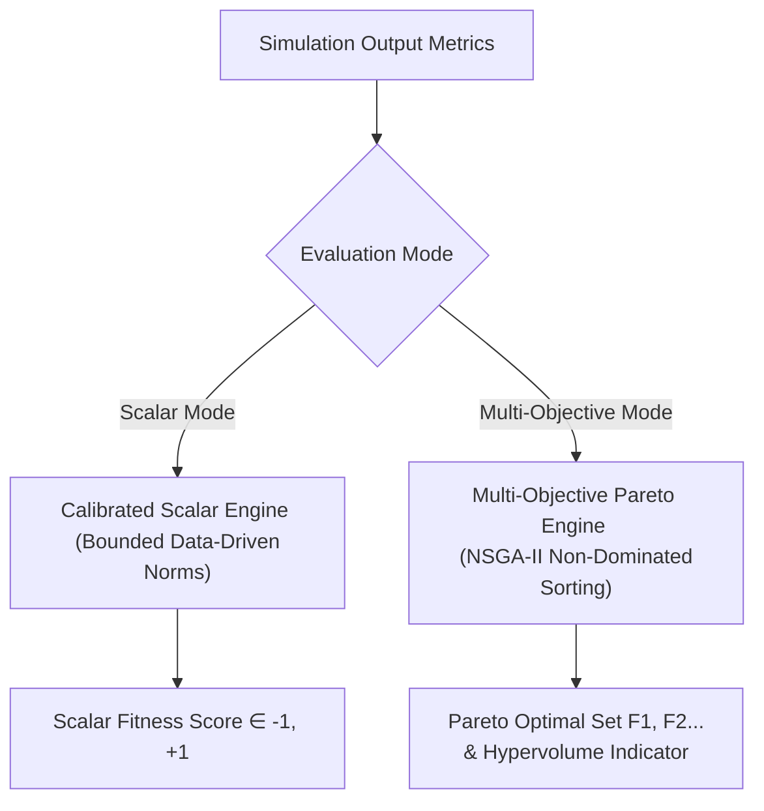
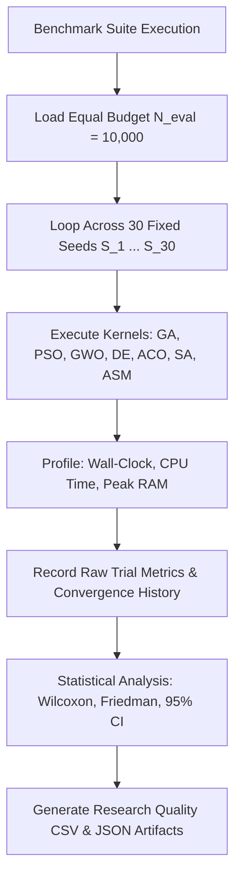
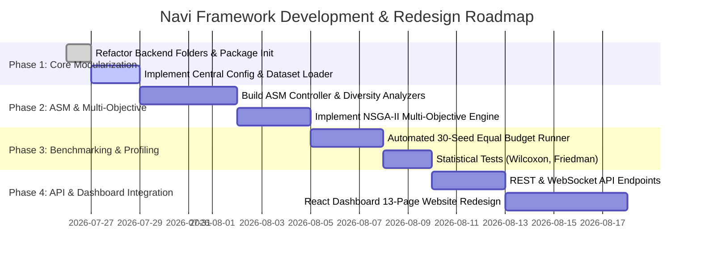

# 🔬 NAVI — ADAPTIVE TRAFFIC INTELLIGENCE FRAMEWORK
## Master Architecture, Research Specification & Technical Blueprint
**Document Version:** 2.0.0-REFAC  
**Status:** Architecture Design & Blueprint Specification  

---

## EXECUTIVE SUMMARY

Navi is a research-grade framework designed to optimize traffic signal timing at complex road intersections. It integrates **Parameterized Mamdani Fuzzy Logic Systems (FIS)** with continuous metaheuristic optimization algorithms and a dynamic **Adaptive Strategy Metaheuristic (ASM)**.

This master blueprint establishes the complete technical design, module separation, scientific benchmarking protocol, explainability framework, and content architecture for Navi.

---

# SECTION 1: SYSTEM ARCHITECTURE

Navi is structured into **11 decoupled, single-responsibility operational layers**. Each layer communicates through defined typed interfaces, enabling modular experimentation, automated benchmarking, and seamless future API integration.



### Layer Responsibilities

| Layer | Component Name | Core Responsibilities | Input Interface | Output Interface |
|---|---|---|---|---|
| **1** | `Dataset Layer` | Stream, cache, and normalize raw telemetry dataset records (`vanet.csv`). | Raw CSV filepath | Pandas DataFrame / Tensor stream |
| **1** | `Configuration Layer` | Centralized hyperparameter, bound, seed, and path configurations. | YAML/JSON config | Typed `Config` dataclass |
| **2** | `Fuzzy Engine` | Builds Mamdani FIS, maps 35-dim parameter vectors to MFs, computes green times via centroid defuzzification. | 35-d parameter vector + telemetry row | Green time duration ($10\text{s}-90\text{s}$) |
| **2** | `Traffic Simulation` | Simulates $N$-cycle intersection dynamics using Greenshields speed-density and Webster delay formulations. | Signal phase allocations | Raw execution metrics dict |
| **3** | `Evaluation` | Computes scalar fitness and multi-objective Pareto vectors from simulation telemetry. | Simulation result dict | Scalar score / Pareto front |
| **4** | `Optimization Engine` | Executes single-population metaheuristic search kernels (GA, PSO, GWO, DE, ACO, SA). | Search bounds + evaluation target | Optimal parameter vector |
| **4** | `Adaptive Strategy (ASM)` | Dynamically samples, evaluates, and switches search kernels based on real-time population diversity & entropy. | Population state vector | Selected strategy + step output |
| **5** | `Experiment Manager` | Manages deterministic trials, seed sequences, budget enforcement, and parallel execution runs. | Benchmark suite specification | Execution logs & raw results |
| **5** | `Analytics` | Performs statistical tests (Wilcoxon, Friedman), 95% CIs, memory/CPU profiling, and convergence fitting. | Raw trial execution outputs | Statistical report dataclass |
| **6** | `API Layer` | Exposes REST endpoints and WebSocket telemetry streams for frontend and external integrations. | HTTP / WS requests | JSON responses / stream frames |
| **6** | `Visualization` | Renders interactive glassmorphism UI, real-time Canvas animation, and analytical charts. | API JSON payloads | Interactive Web UI |

---

# SECTION 2: REFACTORED PROJECT STRUCTURE

The repository is organized into dedicated, single-purpose packages inside `backend/`, `frontend/`, and `docs/`:

```
Navi/
├── backend/
│   ├── adaptive/                 # Adaptive Strategy Metaheuristic (ASM) Framework
│   │   ├── __init__.py
│   │   ├── controller.py         # ASM Main Orchestrator
│   │   ├── diversity.py          # Population Diversity & Entropy Analyzers
│   │   ├── memory.py             # Knowledge & Velocity Memory Archive
│   │   ├── selector.py           # Multi-Armed Bandit / Markov Strategy Selectors
│   │   └── termination.py        # Budget & Convergence Termination Monitors
│   │
│   ├── algorithms/               # Standard Metaheuristic Search Kernels
│   │   ├── __init__.py
│   │   ├── base.py               # Abstract Base Optimizer Class
│   │   ├── ga.py                 # Genetic Algorithm (SBX + Polynomial Mutation)
│   │   ├── pso.py                # Particle Swarm Optimization
│   │   ├── gwo.py                # Grey Wolf Optimizer
│   │   ├── de.py                 # Differential Evolution (DE/rand/1/bin)
│   │   ├── aco.py                # Continuous Domain Ant Colony Optimization (ACOR)
│   │   └── sa.py                 # Simulated Annealing
│   │
│   ├── analytics/                # Statistical Analysis & Metrics Profiler
│   │   ├── __init__.py
│   │   ├── metrics.py            # Throughput, Latency, Queue, & Speed Metrics
│   │   ├── statistics.py         # Wilcoxon, Friedman, & 95% Confidence Intervals
│   │   └── profiler.py           # Memory Footprint & Wall-Clock Timer Profiler
│   │
│   ├── api/                      # External & Dashboard API Interface
│   │   ├── __init__.py
│   │   ├── routes.py             # REST API Endpoints
│   │   └── websocket.py          # Real-time Simulation Telemetry Streamer
│   │
│   ├── configs/                  # Centralized Project Configuration Schemas
│   │   ├── __init__.py
│   │   ├── benchmark_config.py   # Benchmark Budget & Seed Definitions
│   │   └── system_config.py      # Fuzzy & Physics Engine Parameters
│   │
│   ├── datasets/                 # Telemetry & Infrastructure Datasets
│   │   ├── __init__.py
│   │   ├── loader.py             # Dataset Ingestion & Validation Module
│   │   └── vanet.csv             # Ingested VANET Telemetry Dataset
│   │
│   ├── evaluation/               # Objective Function & Pareto Framework
│   │   ├── __init__.py
│   │   ├── fitness.py            # Standard Scalar Fitness Engine
│   │   └── multiobjective.py     # Multi-Objective Pareto & Hypervolume Kernel
│   │
│   ├── experiments/              # Benchmark Suite Execution Runner
│   │   ├── __init__.py
│   │   └── runner.py             # Automated Fair Multi-Trial Execution Suite
│   │
│   ├── fuzzy/                    # Parameterized Mamdani Fuzzy Inference System
│   │   ├── __init__.py
│   │   ├── fuzzy_system.py       # 35-Dim MF Breakpoint Builder & Inference Engine
│   │   └── explainability.py     # Fuzzy Rule Firing & Membership Inspector
│   │
│   ├── simulation/               # Microscopic Intersection Physics Simulator
│   │   ├── __init__.py
│   │   └── traffic_model.py      # Greenshields & Webster Traffic Flow Engine
│   │
│   ├── tests/                    # Automated Verification & Unit Tests
│   │   ├── __init__.py
│   │   ├── test_algorithms.py    # Optimizer Convergence Verification
│   │   ├── test_fuzzy.py         # FIS Inference & Defuzzification Tests
│   │   └── test_simulation.py   # Traffic Physics Conservation Tests
│   │
│   ├── main.py                   # Main Pipeline Entrypoint
│   └── requirements.txt          # Dependency Manifest
│
├── docs/                         # Scientific & Technical Specifications
│   └── architecture_master_blueprint.md
│
└── frontend/                     # Interactive React Research Dashboard
    ├── public/fonts/FootlightMTLight.ttf
    └── src/
        ├── config/constants.js
        ├── components/
        ├── pages/
        └── simulation/TrafficSim.js
```

---

# SECTION 3: OPTIMIZATION FRAMEWORK ANALYSIS

Below is a rigorous theoretical review of every metaheuristic optimizer in Navi, documenting strengths, weaknesses, assumptions, complexity, and literature verification targets.



### Comprehensive Optimizer Profile Matrix

| Optimizer | Primary Search Behavior | Theoretical Strengths | Known Limitations | Mathematical Assumptions | Time Complexity (per gen) | Literature Reference Target |
|---|---|---|---|---|---|---|
| **GA** | Global Exploration | SBX crossover preserves sub-component schemata; polynomial mutation prevents permanent dimensional trapping. | Slow local convergence near global optima; sensitive to crossover probability $p_c$. | Continuous fitness landscape; parameter independence. | $\mathcal{O}(P \cdot D + P \log P)$ | Deb & Agrawal (1995) |
| **PSO** | Trajectory Swarm Search | High convergence speed on unimodal surfaces; social memory guides collective momentum. | Susceptible to premature convergence in high-dimensional multimodal space ($D=35$). | Differentiable velocity vectors; bounded search space. | $\mathcal{O}(P \cdot D)$ | Kennedy & Eberhart (1995) |
| **GWO** | Hierarchical Guidance | Dynamic transition parameter $a: 2 \to 0$ balances exploration and exploitation; strong alpha guidance. | Alpha, Beta, Delta wolves can form local stagnation trap if all three occupy same local basin. | Unimodal/smooth global basin hypothesis. | $\mathcal{O}(P \cdot D + P \log P)$ | Mirjalili et al. (2014) |
| **DE** | Difference Vector Search | Self-adaptive step size driven by population variance; robust performance on correlated dimensions. | High sensitivity to scale factor $F$ and crossover rate $CR$; slower on low-dimensional peaks. | Scale invariance; linear combination validity. | $\mathcal{O}(P \cdot D)$ | Storn & Price (1997) |
| **ACO** | PDF Mixture Sampling | Gaussian kernel PDF constructed from archive captures multi-modal density distributions. | Archive size $k$ limits representation; variance shrinkage ($\xi$) can freeze search prematurely. | Continuous Gaussian density distribution. | $\mathcal{O}(k \cdot D + P \cdot k \cdot D)$ | Socha & Dorigo (2008) |
| **SA** | Local Neighborhood Annealing | Metropolis probability $P = \exp(\Delta E / T)$ guarantees asymptotic convergence to global optimum. | Strictly single-point search; computationally inefficient for global exploration without swarm. | Markov chain stationary distribution equilibrium. | $\mathcal{O}(D)$ per step | Kirkpatrick et al. (1983) |

---

# SECTION 4: ADAPTIVE STRATEGY METAHEURISTIC (ASM) BLUEPRINT

The **Adaptive Strategy Metaheuristic (ASM)** replaces rigid hybrid pipelines (e.g., fixed GA $\to$ ACO $\to$ SA loops). Instead of enforcing a hardcoded execution sequence, ASM operates as a **closed-loop feedback control system** that monitors population entropy and stagnation, dynamically selecting the optimal search kernel at runtime.



### ASM Component Specifications

1. **Population Manager ($\mathcal{P}$)**: Maintains a unified population tensor of dimension $P \times 35$. Handles vector normalization, clipping, and elite retention across strategy transitions.
2. **Search Analyzer ($\mathcal{S}$)**: Computes real-time search state metrics every iteration:
   - **Population Diversity Index ($\mathcal{D}$)**:
     $$\mathcal{D}(\mathcal{P}) = \frac{1}{P \cdot D} \sum_{i=1}^{P} \sum_{d=1}^{D} |x_{i,d} - \bar{x}_d|$$
   - **Fitness Velocity ($\mathcal{V}_f$)**: Rate of best-fitness improvement over a sliding window $w=5$.
   - **Stagnation Counter ($c_{\text{stag}}$)**: Number of consecutive generations without improvement exceeding threshold $\epsilon = 10^{-5}$.
3. **Strategy Selector ($\mathcal{K}$)**: Selects active search kernel using Upper Confidence Bound (UCB1) or Thompson Sampling:
   $$a_t = \arg\max_{a \in \mathcal{A}} \left( \hat{Q}(a) + c \cdot \sqrt{\frac{\ln N_t}{N_t(a)}} \right)$$
   Where $\hat{Q}(a)$ is average fitness gain yielded by algorithm $a$, $N_t(a)$ is selection count, and $c$ controls exploration weight.
4. **Knowledge Memory ($\mathcal{M}$)**: Shared global archive storing elite vectors, directional velocity gradients, and covariance matrices accessible by all strategies.
5. **Adaptive Controller ($\mathcal{C}$)**: Computes reward $r_t = f(x_{\text{new}}) - f(x_{\text{old}})$ and updates Q-values $\hat{Q}(a)$. Trigger switching when $\mathcal{D}(\mathcal{P}) < \mathcal{D}_{\text{min}}$ (triggers explorative GA/DE) or when $c_{\text{stag}} > c_{\text{threshold}}$ (triggers SA annealing jump).
6. **Termination Manager ($\mathcal{T}$)**: Halts execution strictly when total evaluation budget $N_{\text{eval\_max}}$ is reached or when fitness variance falls below $10^{-8}$.

### Dynamic Switching Logic Table

| Observed Search State | Diversity $\mathcal{D}(\mathcal{P})$ | Fitness Velocity $\mathcal{V}_f$ | Stagnation $c_{\text{stag}}$ | Selected Strategy | Rationale |
|---|---|---|---|---|---|
| **High Exploration** | $> 0.25$ | High ($\mathcal{V}_f > 0.05$) | 0 | **DE / GA** | Maintain global search coverage across unmapped regions. |
| **Swarm Convergence** | $0.10 - 0.25$ | Moderate | $< 3$ | **PSO / GWO** | Rapidly concentrate swarm around promising global basin. |
| **Local Stagnation** | $< 0.10$ | Near Zero ($\mathcal{V}_f < 10^{-4}$) | $> 5$ | **SA** | Inject thermal perturbations to jump out of local optima. |
| **Fine Refinement** | $< 0.05$ | Low | $> 8$ | **ACOR** | Sample continuous Gaussian PDF around refined archive. |

---

# SECTION 5: FITNESS & EVALUATION FRAMEWORK

### Limitations of Legacy Scalar Fitness
The previous scalar formulation:
$$\text{fitness} = +0.35 \cdot \text{flow\_norm} + 0.30 \cdot \text{speed\_norm} - 0.15 \cdot \text{wait\_norm} - 0.10 \cdot \text{queue\_norm} - 0.10 \cdot \text{pressure\_norm}$$
suffered from:
1. **Saturated Reference Penalisations**: Reference values (e.g., $\text{pressure\_ref} = 2.5$) caused $\tanh(\text{pressure} / 2.5) \approx 1.0$ constantly, turning the pressure penalty into a fixed constant.
2. **Loss of Trade-off Visibility**: Collapsing opposing traffic objectives (maximizing speed vs minimizing queue) into a single scalar masked Pareto trade-off dynamics.

### Redesigned Evaluation Framework

Navi supports both a **Calibrated Scalar Engine** and a **Multi-Objective Pareto Engine**.



#### 1. Calibrated Scalar Fitness
$$\text{Fitness}(\mathbf{\theta}) = w_f \cdot \hat{F} + w_v \cdot \hat{V} - w_w \cdot \hat{W} - w_q \cdot \hat{Q} - w_p \cdot \hat{P}$$
Where normalized variables use empirical quantiles derived directly from $195,000$ VANET telemetry rows:
$$\hat{X} = \frac{X - X_{\text{p5}}}{X_{\text{p95}} - X_{\text{p5}}}, \quad \text{clipped to } [0, 1]$$

#### 2. Multi-Objective Formulation (NSGA-II Compatible)
Navi defines a 3-vector objective function $\mathbf{F}(\mathbf{\theta}) = [f_1(\mathbf{\theta}), f_2(\mathbf{\theta}), f_3(\mathbf{\theta})]^T$:
1. **Maximize Throughput**: $f_1(\mathbf{\theta}) = \text{Total Flow (veh/hr)}$
2. **Minimize Infrastructure Latency**: $f_2(\mathbf{\theta}) = \text{Average Wait Time (s)}$
3. **Minimize Queue Saturation**: $f_3(\mathbf{\theta}) = \text{Average Queue Length (vehicles)}$

Solutions are evaluated using **Pareto Dominance**: Solution $\mathbf{A}$ dominates $\mathbf{B}$ ($\mathbf{A} \succ \mathbf{B}$) iff:
$$\forall i \in \{1,2,3\}, f_i(\mathbf{A}) \ge f_i(\mathbf{B}) \quad \text{and} \quad \exists j \in \{1,2,3\}, f_j(\mathbf{A}) > f_j(\mathbf{B})$$

---

# SECTION 6: SCIENTIFIC BENCHMARKING PROTOCOL

To ensure research-grade validation, Navi implements a **Fair Benchmarking Protocol**:



### Protocol Rules

1. **Strict Evaluation Budget Equality**: Every algorithm receives an identical total function evaluation budget:
   $$N_{\text{eval}} = 10,000 \quad \text{evaluations}$$
   (e.g., $P=50, N_{\text{gen}}=200$; or $P=100, N_{\text{gen}}=100$). No algorithm receives extra hill-climbing or polishing steps outside this budget.
2. **Deterministic Seed Sequences**: All algorithms are evaluated over **30 independent runs** using identical seed vectors:
   $$\mathcal{S} = \{42, 101, 2024, 888, 1337, \dots, S_{30}\}$$
3. **Statistical Hypothesis Testing**:
   - **Pairwise Comparison**: Non-parametric **Wilcoxon Signed-Rank Test** ($\alpha = 0.05$).
   - **Multi-Algorithm Ranking**: **Friedman Test** with Nemenyi post-hoc analysis.
4. **Reported Metrics & Metrics Data Structure**:
   - **Mean Fitness & Variance**: $\bar{f} \pm \sigma^2$
   - **95% Confidence Intervals**: $\bar{f} \pm 1.96 \cdot \frac{\sigma}{\sqrt{N}}$
   - **Convergence Speed**: Iterations required to reach $90\%$ of optimal fitness.
   - **Wall-Clock & CPU Execution Time**: Precision timing in milliseconds.
   - **Peak Memory Footprint**: Measured via `tracemalloc` in megabytes (MB).

---

# SECTION 7: WEBSITE CONTENT ARCHITECTURE

The Navi website architecture is structured across 13 dedicated content pages designed for research education and framework interaction:

```
Navi Website Structure
├── 1. Home Page                   (Framework Abstract, Key Stats, Quick Launch)
├── 2. Architecture               (11-Layer Interactive Flowchart & API Specs)
├── 3. Traffic Model               (Greenshields & Webster Physics Engine Theory)
├── 4. Dataset Explorer            (VANET 195k Records Profiler & Distro Charts)
├── 5. Fuzzy Logic Overview        (Mamdani FIS Concepts & Defuzzification Math)
├── 6. Membership Functions        (Interactive 35-Dim Breakpoint Tuning Visualizer)
├── 7. Rule Base Matrix            (9-Rule Linguistic Decision Table & Firing Simulator)
├── 8. Optimization Algorithms     (Interactive Benchmark Matrix for GA, PSO, GWO, DE, ACO, SA)
├── 9. Adaptive Strategy (ASM)     (ASM Control Engine, Entropy Meter, & Strategy Switch Log)
├── 10. Traffic Simulation         (Canvas Intersection Telemetry & Signal State Inspector)
├── 11. Experiment Runner          (Custom Multi-Run Benchmark Configurator)
├── 12. Benchmark Results          (Radar, Heatmaps, Box Plots, & Wilcoxon Tables)
└── 13. Developer & API Guide      (REST/WebSocket Documentation & Python SDK)
```

---

# SECTION 8: EXPLAINABILITY FRAMEWORK

Navi includes a dual-layer explainability engine providing real-time transparency into both fuzzy signal decisions and adaptive search behavior.


### 1. Fuzzy Engine Inspector Output Schema
```json
{
  "timestamp": "2026-07-26T15:42:00Z",
  "inputs": {
    "congestion_pressure": 85.2,
    "density_veh_per_km": 192.4,
    "queue_length_veh": 96.1,
    "avg_wait_time_s": 3033.9,
    "flow_veh_per_hr": 1543.0
  },
  "memberships": {
    "congestion_pressure": {"low": 0.0, "medium": 0.12, "high": 0.88},
    "queue_length_veh": {"short": 0.0, "medium": 0.20, "long": 0.80}
  },
  "fired_rules": [
    {"rule_id": 1, "text": "IF Congestion High AND Queue Long", "strength": 0.80, "consequent": "green_time IS long"},
    {"rule_id": 4, "text": "IF Wait Time High", "strength": 0.75, "consequent": "green_time IS long"}
  ],
  "defuzzification": {
    "method": "centroid",
    "numerator": 4215.0,
    "denominator": 56.2,
    "final_green_time_s": 75.0
  },
  "explanation": "Signal duration extended to 75s (Long) due to critical Congestion Pressure (0.88 High) and Queue Length (0.80 Long)."
}
```

### 2. ASM Controller Inspector Output Schema
```json
{
  "generation": 45,
  "diversity_index": 0.082,
  "fitness_velocity": 0.00002,
  "stagnation_counter": 6,
  "active_strategy": "SA",
  "previous_strategy": "GWO",
  "transition_reason": "Diversity fell below threshold (0.082 < 0.10) with stagnation count 6. Switched from GWO to SA to inject thermal perturbations.",
  "reward_history": {"GA": 0.14, "PSO": 0.08, "GWO": 0.02, "DE": 0.11, "ACO": 0.05, "SA": 0.19}
}
```

---

# SECTION 9: IMPLEMENTATION ROADMAP



---

## MANUAL TESTING INSTRUCTIONS FOR USER

To verify the current refactored structure:

1. **Verify Backend Directory Layout**:
   ```bash
   cd backend
   python -c "import algorithms, adaptive, simulation, evaluation, fuzzy, datasets; print('All Navi modules import cleanly!')"
   ```

2. **Run Standard Optimizer Benchmark Pipeline**:
   ```bash
   cd backend
   python main.py --fast
   ```

3. **Run Standalone Fuzzy Inference Inspector**:
   ```bash
   cd backend
   python run_fuzzy_demo.py
   ```
